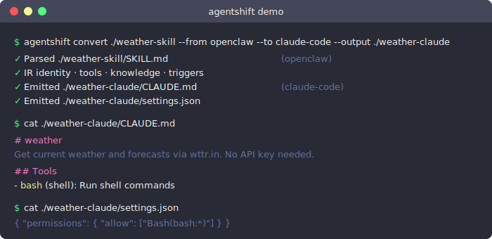

<h1 align="center">AgentShift</h1>
<p align="center"><em>Convert AI agents between platforms. Define once, run anywhere.</em></p>

<p align="center">
  
</p>

<p align="center">
  <a href="https://github.com/ogkranthi/agentshift/actions"></a>
  <a href="https://pypi.org/project/agentshift/"></a>
  <a href="https://pypi.org/project/agentshift/"></a>
  <a href="LICENSE"></a>
</p>

---

Your OpenClaw skill, your Bedrock Agent, your Copilot — they all speak different dialects.
**AgentShift is the translator.**

## Install

```bash
# pip
pip install agentshift

# from source
git clone https://github.com/ogkranthi/agentshift.git
cd agentshift && pip install -e .
```

## Usage

```bash
# Copy a built-in OpenClaw skill and convert it to Claude Code
cp -r ~/.nvm/versions/node/v22.22.1/lib/node_modules/openclaw/skills/weather ./weather-skill
agentshift convert ./weather-skill --from openclaw --to claude-code --output ./weather-claude

# Convert any skill you have installed
agentshift convert ~/.openclaw/skills/my-skill --from openclaw --to claude-code --output ./my-skill-claude

# Inspect the output
cat ./weather-claude/CLAUDE.md
cat ./weather-claude/settings.json
```

## How it works

AgentShift parses your agent into a universal **Intermediate Representation (IR)**, then emits platform-specific configs.

```
  1. Parse  →  SKILL.md · CLAUDE.md · manifest.json · instruction.txt
               ↓
  2. IR     →  identity · tools · knowledge · triggers · constraints
               ↓
  3. Emit   →  Claude Code  ✅  |  Copilot  🔜  |  Bedrock  🔜  |  Vertex AI  🔜
```

The IR is the core abstraction — captured in `specs/ir-schema.json`. Adding a new platform means writing one parser and/or one emitter. Nothing else changes.

## Supported platforms

| Platform | Read (parser) | Write (emitter) | Status |
|---|:---:|:---:|---|
| OpenClaw | ✅ | ✅ | **Works today** |
| Claude Code | ✅ | ✅ | **Works today** |
| Microsoft Copilot | — | — | Coming soon |
| AWS Bedrock | — | — | Coming soon |
| GCP Vertex AI | — | — | Coming soon |
| LangGraph | — | — | Planned |
| CrewAI | — | — | Planned |

## Using converted skills in Claude Code

Once you've converted a skill, here's how to activate it in Claude Code so it works similarly to OpenClaw.

### Step 1: Convert

```bash
agentshift convert ~/.openclaw/skills/github --from openclaw --to claude-code --output ./github-claude
```

This produces:
```
github-claude/
├── CLAUDE.md       ← instructions + persona (Claude Code reads this automatically)
└── settings.json   ← tool permissions (Bash, MCP, Read/Write paths)
```

### Step 2: Place the files

Claude Code picks up `CLAUDE.md` and `settings.json` from these locations (in priority order):

| Location | Scope | When to use |
|---|---|---|
| `~/.claude/CLAUDE.md` | Global — all projects | Skills you want everywhere (weather, github) |
| `<project>/.claude/CLAUDE.md` | Project-only | Skills scoped to one repo |
| `<project>/CLAUDE.md` | Project-only (alternative) | Same as above |

```bash
# Option A — global (skill available in every Claude Code session)
mkdir -p ~/.claude
cp github-claude/CLAUDE.md ~/.claude/CLAUDE.md
cp github-claude/settings.json ~/.claude/settings.json

# Option B — project-scoped
mkdir -p my-project/.claude
cp github-claude/CLAUDE.md my-project/.claude/CLAUDE.md
cp github-claude/settings.json my-project/.claude/settings.json
```

> **Multiple skills:** Claude Code only loads one `CLAUDE.md` per scope. To combine multiple skills, concatenate their `CLAUDE.md` files and merge their `settings.json` permission arrays manually — or use `agentshift merge` (coming soon).

### Step 3: Use it

Open Claude Code in the project directory. The skill instructions load automatically.

```bash
cd my-project
claude   # or claude --print "check open PRs"
```

Claude Code will follow the skill's instructions and respect the tool permissions from `settings.json`.

### Step 4: Verify tool permissions

Check that the permissions emitted match what you expect:

```bash
cat github-claude/settings.json
# → { "permissions": { "allow": ["Bash(gh:*)", "Bash(git:*)"] } }
```

This means Claude Code can run `gh` and `git` commands — but nothing else — matching the skill's intent.

---

### What carries over from OpenClaw

| OpenClaw feature | Claude Code equivalent | Status |
|---|---|---|
| Skill instructions (SKILL.md body) | `CLAUDE.md` — loaded automatically | ✅ Full fidelity |
| Shell tool permissions | `settings.json` `allow: ["Bash(<binary>:*)"]` | ✅ Precise per-binary |
| MCP tools (slack, github, discord) | `settings.json` `allow: ["mcp__<name>__*"]` | ✅ Works if MCP server configured |
| Knowledge files | `CLAUDE.md` knowledge section + `Read(path)` permissions | ✅ Paths preserved |
| Data file writes | `Write(path)` in `settings.json` | ✅ Exact paths |
| OS constraints | `settings.json` `supportedOs` | ✅ Preserved |
| Install dependencies | Not applicable — Claude Code assumes tools are installed | ⚠️ Manual step |
| Cron / scheduled triggers | **Not supported in Claude Code** | ❌ See below |
| Telegram / Slack delivery channels | **Not supported in Claude Code** | ❌ See below |
| OpenClaw config keys (`channels.slack`) | Not applicable — Claude Code uses MCP config | ⚠️ Reconfigure MCP |

---

### Gaps — what Claude Code can't do (yet)

**1. Scheduled triggers (cron)**
OpenClaw skills can fire on a schedule (`0 9 * * *`). Claude Code has no built-in scheduler.

*Workaround:* Use system cron or GitHub Actions to call `claude --print "<trigger message>"` on a schedule:
```bash
# crontab -e
0 9 * * * cd /your/project && claude --print "Give today's pregnancy tip" >> ~/logs/tip.log 2>&1
```

**2. Proactive delivery (Telegram, Slack, Discord)**
OpenClaw can push messages to channels when triggered. Claude Code only responds — it doesn't push.

*Workaround:* Wrap `claude --print` output in a script that pipes to your messaging service:
```bash
RESPONSE=$(claude --print "Give today's tip")
curl -s -X POST "https://api.telegram.org/bot$TOKEN/sendMessage" \
  -d chat_id="$CHAT_ID" -d text="$RESPONSE"
```

**3. Persistent memory across sessions**
OpenClaw persists `MEMORY.md` between sessions. Claude Code sessions are stateless by default.

*Workaround:* Pass memory files as context: `claude --print "$(cat MEMORY.md)\n\nUser: ..."` or use a project-level `CLAUDE.md` that references memory files.

**4. Multi-channel routing**
OpenClaw can route to different channels based on context. Claude Code outputs to stdout only.

---

## See a real conversion

The [`examples/`](examples/) directory has 4 complete before/after conversions.

**Input** — `examples/weather-to-claude-code/input/SKILL.md` (OpenClaw):

```yaml
---
name: weather
description: "Get current weather and forecasts via wttr.in. No API key needed."
metadata: { "openclaw": { "emoji": "☔", "requires": { "bins": ["curl"] } } }
---

# Weather Skill

## Commands

```bash
curl "wttr.in/London?format=3"      # one-line summary
curl "wttr.in/London"               # 3-day forecast
curl "wttr.in/London?format=j1"     # JSON output
```
```

**Output** — `examples/weather-to-claude-code/output/CLAUDE.md` (Claude Code):

```markdown
# weather

Get current weather and forecasts via wttr.in. No API key needed.

## Instructions
...

## Tools
- **bash** (shell): Run shell commands
```

**Output** — `examples/weather-to-claude-code/output/settings.json`:

```json
{ "permissions": { "allow": ["Bash(curl:*)"] } }
```

More examples: [github](examples/github-to-claude-code/) · [slack](examples/slack-to-claude-code/) · [notion](examples/notion-to-claude-code/)

## Contributing

Contributions welcome — especially new platform parsers/emitters.

See [CONTRIBUTING.md](CONTRIBUTING.md) for setup, architecture, and PR guidelines.

```bash
git clone https://github.com/ogkranthi/agentshift.git
cd agentshift
pip install -e ".[dev]"
agentshift --help
```

Open a [Platform Request](https://github.com/ogkranthi/agentshift/issues/new?template=platform_request.yml) to discuss adding a new target.

## License

[Apache License 2.0](LICENSE)
